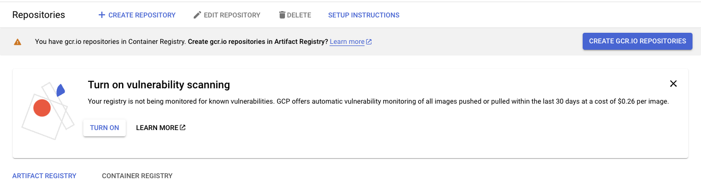
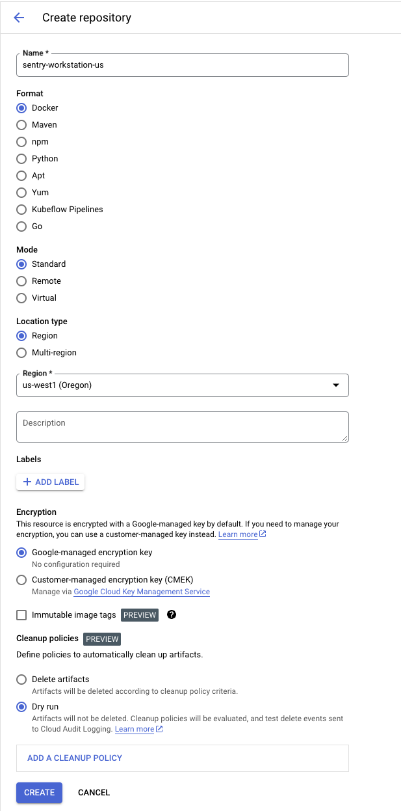
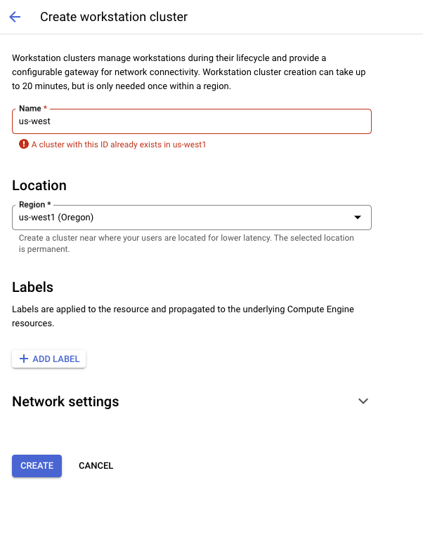
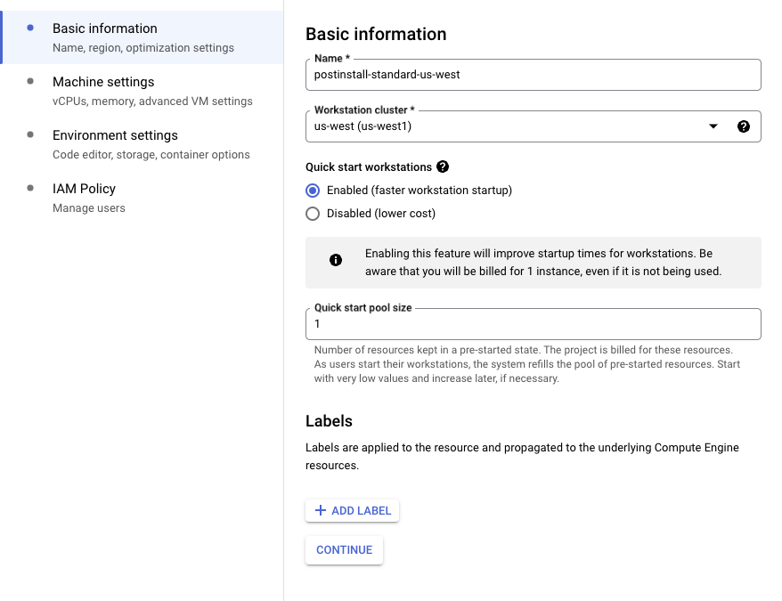
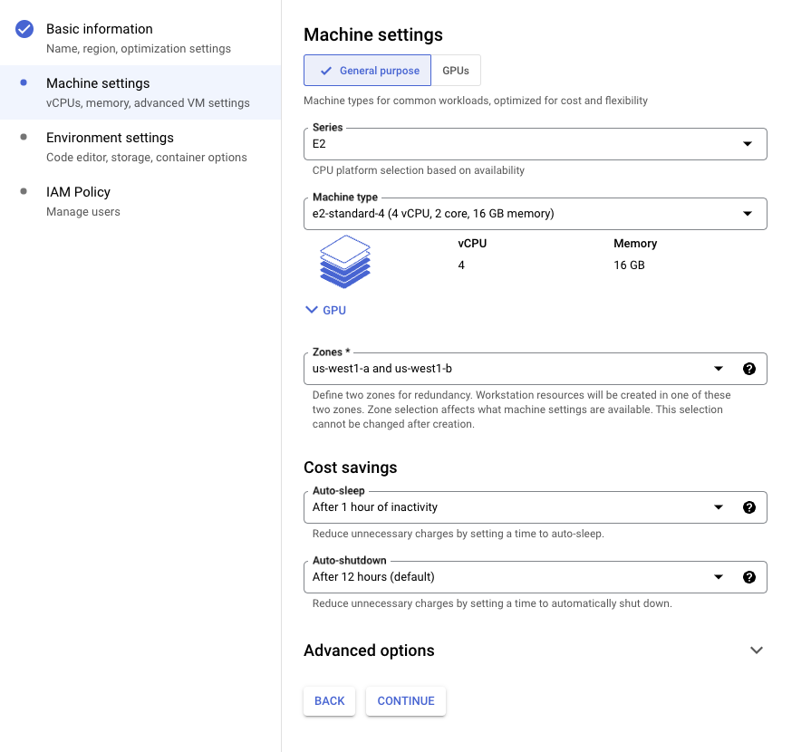
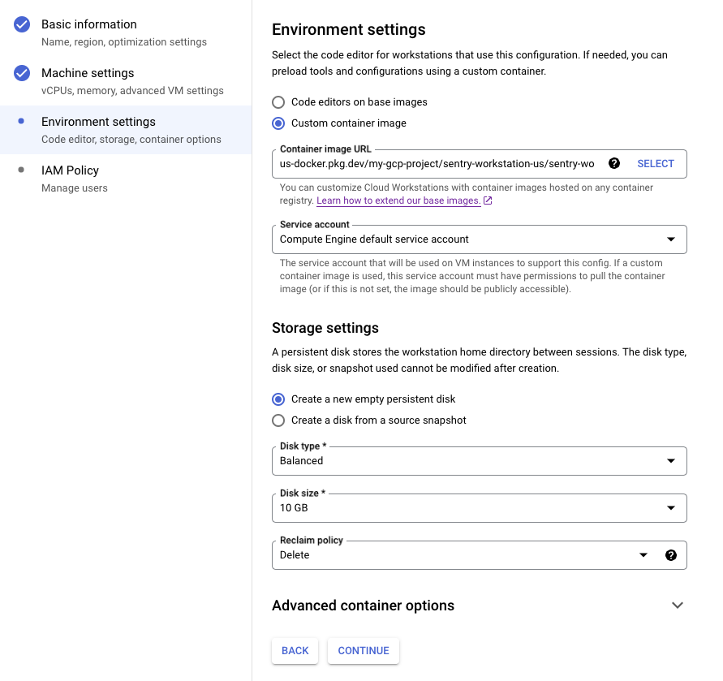

# Remote Self-Hosted Development on Google Cloud Workstation

This document specifies how to set up remote workstation development for `self-hosted` using Google
Cloud. While this feature is primarily intended for Sentry developers seeking to develop or test
changes to `self-hosted`, in theory anyone with a Google Cloud account and the willingness to incur
the associated costs could replicate the setup described here.

The goal of remote workstations is to provide turn-key instances for developing on `self-hosted`, in
either postinstall (the `/.install.sh` script has already run) or preinstall (it has not) modes. By
using Ubuntu as a base image, we are able to provide a fresh development environment that is very
similar to the Linux-based x86 instances that self-hosted is intended to be deployed to.

Specifically, the goals of this effort are:

- Create and manage turn-key virtual machines for development in either preinstall or postinstall
  mode quickly and with minimal manual user input.
- Simulate real `self-hosted` deployment environments as faithfully as possible.
- Create a smooth developer experience when using VSCode and GitHub.

The last point is worth emphasizing: this tool is specifically optimized to work well with VSCode
remote server (for the actual development) and GitHub (for pushing changes). Supporting any other
workflows is an explicit ***non-goal*** of this setup.

The instructions here are for how to setup workstations as an administrator (that is, the person in
charge of managing and paying for the entire fleet of workstations). End users are expected to
create, connect to, manage, and shut down workstations as needed via the the `sentry` developer CLI
using the `sentry workstations ...` set of commands. For most use cases outside of
Sentry-the-company, the administrator and end user will be the same individual: they'll configure
their Google Cloud projects and billing, and then use them via `sentry workstations ...` commands on
their local machine.

## Configuring Google Cloud

You'll need to use two Google Cloud services to enable remote `self-hosted` deployment: Google Cloud
Workstations to run the actual virtual machines, and the Artifact Registry to store the base images
described in the adjacent Dockerfiles.

The rest of this document will assume that you are configuring these services to be used from the
west coast of the United States (ie: `us-west1`), but a similar set of processes could be applied
for any region supported by Google Cloud.

### Creating an Artifact Registry

You can create an artifact registry using the Google Cloud Platform UI
[here](https://console.cloud.google.com/artifacts):



The dialog should be straightforward. We'll name our new repository `sentry-workstation-us` and put
it in `us-west1`, but you could change these to whatever options suit your liking. Leave the
remaining configurations as they are:



### Setting up Cloud Workstations

To use Google Cloud Workstations, you'll need to make at least one workstation cluster, and at least
one configuration therein.

Navigate to the services [control panel](https://console.cloud.google.com/workstations/overview).
From here, you'll need to make one cluster for each region you plan to support. We'll make one for
`us-west1` in this tutorial, naming it `us-west` for clarity:



Now, create a new configuration for that cluster. There are a few choices to make here:

- Do you want it to be a preinstall (ie, `./install.sh` has not run) or postinstall (it has)
  instance?
- Do you want to use a small, standard or large resource allocation?
- How aggressively do you want to auto-sleep and auto-shutdown instances? More aggressive setups
  will save money, but be more annoying for end users.

For this example, we'll make a `postinstall` instance with a `standard` resource allocation, but you
can of course change these as you wish.

On the first panel, name the instance (we recommend using the convention
`[INSTALL_KIND]-[SIZE]-[CLUSTER_NAME]`, so this one `postinstall-standard-us-west`) and assign it to
the existing cluster:



Next, pick a resource and cost saving configuration that makes sense for you. In our experience, an
E2 instance is plenty for most day-to-day development work.



On the third panel, select `Custom container image`, then choose one of your `postinstall` images
(see below for how to generate these). Assign the default Compute Engine service account to it, then
choose to `Create a new empty persistent disk` for it. A balanced 10GB disk should be plenty for
shorter development stints:



On the last screen, set the appropriate IAM policy to allow access to the new machine for your
users. You should be ready to go!

## Creating and uploading an image artifact

Each Cloud Workstation configuration you create will need to use a Docker image, the `Dockerfile`s
and scripts for which are found in this directory. There are two kinds of images: `preinstall` (ie,
`./install.sh` has not run) and `postinstall` (it has). To proceed, you'll need to install the
`gcloud` and `docker` CLI, then login to both and set your project as the default:

```shell
$> export GCP_PROJECT_ID=my-gcp-project  # Obviously, your project is likely to have another name.
$> gcloud auth application-default login
$> gcloud config set project $GCP_PROJECT_ID
$> gcloud auth print-access-token | docker login -u oauth2accesstoken --password-stdin https://us-docker.pkg.dev
```

Next, you'll set some useful variables for this session (note: the code below assumes we are pushing
to the `sentry-workstation-us` repository defined above):

```shell
$> export GROUP=sentry-workstation  # Pick whatever name you like here.
$> export REGION=us  # Name your regions as you see fit - these are not tied to GCP definitions.
$> export PHASE=pre  # Use `pre` for preinstall, `post` for postinstall.
$> export REPO=${GROUP}-${REGION}
$> export IMAGE_TAG=${GROUP}/${PHASE}install:latest
$> export IMAGE_URL=us-docker.pkg.dev/${GCP_PROJECT_ID}/${REPO}/${GROUP}/${PHASE}install:latest
```

Now, build the docker image of your choosing:

```shell
$> docker build -t ${IMAGE_TAG} -f ./${PHASE}install/Dockerfile .
$> docker image ls | grep "${GROUP}/${PHASE}install"
```

Finally, upload it to the Google Cloud Artifact Registry repository of interest:

```shell
$> docker tag ${IMAGE_TAG} ${IMAGE_URL}
$> docker push ${IMAGE_URL}
```

## Creating and connecting to a workstation

Once the Google Cloud services are configured and the docker images uploaded per the instructions
above, end users should be able to list the configurations available to them using `sentry
workstations config`:

```shell
$> sentry workstations configs --project=$GCP_PROJECT_ID

NAME                         CLUSTER  REGION    MACHINE TYPE
postinstall-standard-us-west  us-west  us-west1  e2-standard-4
postinstall-large-us-west     us-west  us-west1  e2-standard-8
preinstall-standard-us-west   us-west  us-west1  e2-standard-4
preinstall-large-us-west      us-west  us-west1  e2-standard-8
```

They will then be able to create a new workstation using the `sentry workstations create` command,
connect to an existing one using `sentry workstations connect`, and use similar `sentry workstations
...` commands to disconnect from and destroy workstations, as well as to check the status of their
active connections. The `create` and `connect` commands will provide further instructions in-band on
how to connect a their local VSCode to the remote server, use SSH to connect to the terminal
directly, add a GitHub access token, or access their running `self-hosted` instance via a web
browser.
